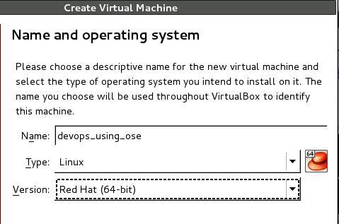
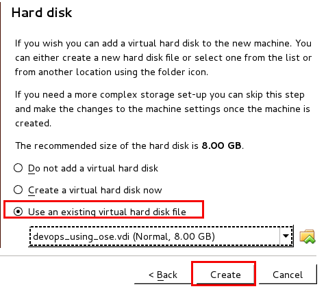
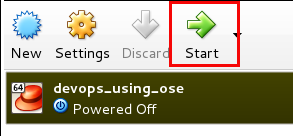

:noaudio:
:toc: manual
:toc-placement: preamble
:virtualbox: link:https://www.virtualbox.org/wiki/Downloads[Virtual Box]
:windupvmi: link:https://spideroak.com/share/O5UW4ZDVOBEW2YLHMU/sr1/Users/RHAdmin/Groups%20Hive/windup/windupCourseStartImage.vdi[Windup Labs Virtual Box Image]

= Lab Setup Overview

.Goals:
. Provide overview of the labs for this course
. Introduction to course virtual machine

:numbered:

== Labs Overview
Welcome to the Red Hat's `Application Migration Using Windup` course.
The labs for this course compliment the slide material and allow for hands-on practical application of Windup migrations.

== Virtual Machine
In order to quickly get you productive with the labs in this course, a virtual machine pre-installed with all of the needed developer tooling is provided.

The {windupvmi} virtual machine is provided in a `VDI` format and can be run on your local workstation using Virtual Box.

Although use of the provided virtual machine is not a requirement, it is highly recommended.
The lab instructions for this course are written with the assumption that this virtual machine is being used.

=== Prereqs

Your local workstation should allow for the installation of 64 bit {virtualbox}.

In addition, it should be able to dedicate a minimum of 2 64-bit CPUs and 2G RAM to the {windupvmi} virtual machine utilized in this course

=== Installation

. Install {virtualbox} on your local workstation.
+
NOTE: The {windupvmi} is a 64 bit virtual machine.
Subsequently, ensure that the x86_64 bit (`amd64`) version of VirtualBox is installed.
. Download the {windupvmi} Virtual Box image.
. Start Virtual Box
. In Virtual Box, navigate to: `Machine -> New`
+

. In the `Create Virtual Machine` panel, populate its fields as follows:
.. `Name:` devops_using_ose
.. `Type:` Linux
.. `Version:` Red Hat (64-bit)
. Click `Next`
. In the `Memory` panel, specify 2048MB of RAM and click `Next`.
. In the `Hard Disk` panel, select `Use an existing virtual hard disk file`.
+

. Browse your hard-drive and select the previously downloaded `devops_using_ose.vdi` image.
. Click `Create`
. Click the `Start` icon
+

=== Login
The operating system utilized in the _devops_using_ose_ VM is Red Hat Enterprise Linux (RHEL) 7.1 with the _GNOME_ window manager.

The following details the operating system users defined on the VM:

.Operating system user accounts
[width="100%",cols="1,2,4",options="header"]
|==============================================
|UserId|Password|Purpose / Description
|root|jb0ssredhat!| Root user. Necessary to execute docker utility
|jboss|jb0ssredhat!| Non-root user.
|==============================================

Once the _devops_using_ose_ VM is started, log in via the Window Manager as the `jboss` operating system user.

=== Test network connectivity
Access to the internet from within the _devops_using_ose_ virtual machine is important.
By default, the network settings of the virtual machine are expecting the Virtual Box host to provide it at startup with an DHCP address.

To test network connectivity of your new VM, execute the following:

. In the VM, open terminal window.
. Execute:
+
-----
ip addr show
-----
+
You should see results similar to the following:
+
-----
enp0s25: <BROADCAST,MULTICAST,UP,LOWER_UP> mtu 1500 qdisc pfifo_fast state UP qlen 1000
    link/ether 54:ee:75:2c:93:91 brd ff:ff:ff:ff:ff:ff
    inet 192.168.0.10/24 brd 192.168.0.255 scope global enp0s25
       valid_lft forever preferred_lft forever
    inet6 fe80::56ee:75ff:fe2c:9391/64 scope link
-----
+
The above output indicates an ip address of 192.168.0.10 was assigned .
. Test network connectivity:
+
-----
$ ping -c 5 8.8.8.8
PING 8.8.8.8 (8.8.8.8) 56(84) bytes of data.
64 bytes from 8.8.8.8: icmp_seq=1 ttl=57 time=20.3 ms
64 bytes from 8.8.8.8: icmp_seq=2 ttl=57 time=20.4 ms
64 bytes from 8.8.8.8: icmp_seq=3 ttl=57 time=20.4 ms
64 bytes from 8.8.8.8: icmp_seq=4 ttl=57 time=20.4 ms
64 bytes from 8.8.8.8: icmp_seq=5 ttl=57 time=20.7 ms

--- 8.8.8.8 ping statistics ---
5 packets transmitted, 5 received, 0% packet loss, time 4005ms
rtt min/avg/max/mdev = 20.311/20.470/20.710/0.223 ms

-----

Congratulations! You now have a workstation that will quickly get you productive in this course.

ifdef::showScript[]

qemu-img convert -O vdi /u02/vm/devops_using_ose/devops_using_ose.qcow2 /u02/vm/devops_using_ose/devops_using_ose.vdi
scp /u02/vm/devops_using_ose/devops_using_ose.vdi jbride-redhat.com@www.opentlc.com:/home/jbride-redhat.com

ssh to www.opentlc.com
sudo mv ~/devops_using_ose.vdi /var/www/html/courses/devops_using_ose/vm
sudo chown gituser:gituser /var/www/html/courses/devops_using_ose/vm/devops_using_ose.vdi
sudo /usr/local/bin/fix-content-perms.sh

endif::showScript[]
